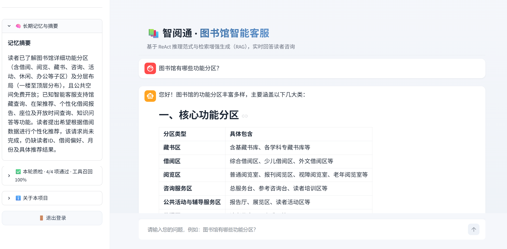
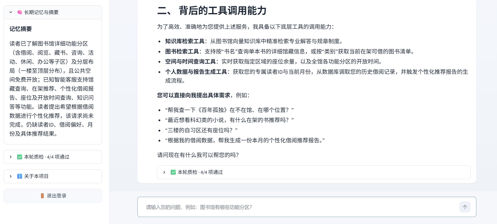
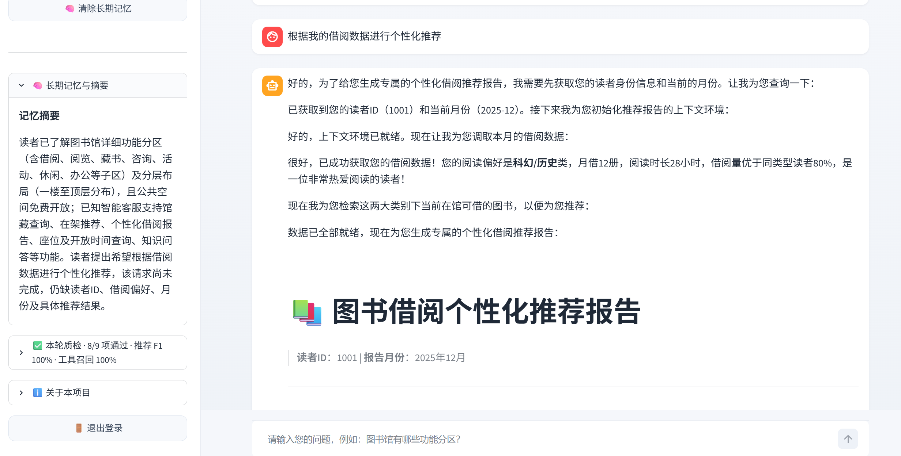

<div align="center">

# 智阅通 · 图书馆智能客服

**基于 LangChain + ReAct 范式 + RAG 检索增强 + MySQL 的图书馆智能客服系统，支持知识问答、个性化借阅推荐与管理员后台**

[](https://www.python.org/)
&nbsp;
[](https://www.langchain.com/)
&nbsp;
[](https://github.com/langchain-ai/langgraph)
&nbsp;
[](https://streamlit.io/)
&nbsp;
[](https://www.mysql.com/)
&nbsp;
[](./LICENSE)

</div>

---

## 项目简介

基于 LangChain 框架实现的 **ReAct（Reasoning + Acting）Agent**，集成 RAG 检索增强、多工具调用和动态提示词切换。系统能根据读者意图自动判断任务类型（知识问答 / 个性化推荐报告），调用合适的工具和知识库完成推理，并通过 Streamlit 流式界面实时展示 Agent 的思考与执行过程。示例场景为图书馆智能客服，可回答功能分区、图书分类、馆藏管理、借阅服务等问题，并基于读者借阅数据生成个性化推荐。

系统采用 **MySQL 作为唯一数据源**：读者/管理员账号、馆藏书目（含可借库存）、借阅记录全部落库。提供**读者登录**与**管理员后台**两套视图；推荐报告强制约束「只能推荐在馆且可借数量大于 0 的图书」，杜绝推荐不存在的书或已借空的书。

## 效果展示

<div align="center">



*图1. 知识问答 — RAG 检索知识库回复*

&nbsp;



*图2. Agent 工具调用 — 实时展示推理与工具执行链路*

&nbsp;



*图3. 图书个性化推荐*

&nbsp;

</div>

## 技术架构

<div align="center">

```
读者输入 (Streamlit 登录后)
      │
      ▼
┌─────────────────────────────────────────┐
│            ReAct Agent                   │
│                                          │
│  ┌──────────┐    ┌──────────────────┐   │
│  │ Thought  │───→│     Action       │   │
│  │ (推理)    │    │ (工具调用 / RAG)  │   │
│  └──────────┘    └────────┬─────────┘   │
│       ↑                   │              │
│       └─── Observation ◄──┘              │
│                                          │
│   Middleware: 工具监控 · 动态提示词切换    │
└─────────────────────────────────────────┘
      │                │              │
      ▼                ▼              ▼
┌──────────┐   ┌────────────┐  ┌──────────┐
│   RAG    │   │   Tools    │  │  Prompt  │
│  Chroma  │   │ 馆藏/座位/  │  │  动态切换  │
│ 向量检索  │   │ 开放时间/   │  │  模板管理  │
│          │   │ 借阅数据    │  │          │
└──────────┘   └─────┬──────┘  └──────────┘
                     │
                     ▼
            ┌──────────────────┐
            │   MySQL          │
            │ users / books /  │
            │ borrow_records / │
            │ borrow_monthly   │
            └──────────────────┘
```

</div>

### 核心特性

| 特性 | 说明 |
|---|---|
| **ReAct 范式** | Thought → Action → Observation 循环，Agent 自主推理并决定调用哪个工具 |
| **RAG 检索增强** | Chroma 向量库 + DashScope Embedding，MD5 文件去重，支持 txt/pdf 混合加载 |
| **MySQL 数据源** | 账号 / 馆藏（含库存）/ 借阅记录全部落库；`python -m db.init_db` 一键建库建表灌数据 |
| **在馆可借强约束** | 推荐书目只能取自 `search_books_by_category` / `search_book` 的返回结果，且可借数量必须 > 0，已借空的书不得列入推荐 |
| **真实账号体系** | 读者注册 / 登录后以真实身份提问；口令以 PBKDF2-SHA256 加盐哈希存储，不存明文 |
| **管理员后台** | 用户管理（增删 / 启用禁用 / 重置密码）、借阅历史查询（月度汇总 + 明细）、图书与库存维护 |
| **多工具调用** | 馆藏检索 / 类别查可借 / 座位查询 / 开放时间 / 借阅数据 / 推荐报告上下文填充，Agent 按需自动选择 |
| **动态提示词切换** | Middleware 根据运行时上下文自动切换「知识问答」与「推荐报告」两套 System Prompt |
| **多轮对话上下文** | 携带最近若干轮问答（默认 10 条，可配），能理解「它」「那本书」「再推荐几本」等指代与省略式追问；对话内读者身份与登录身份一致 |
| **多模型可切换** | 统一经百炼的 OpenAI 兼容端点调用，侧边栏可实时切换通义千问 / DeepSeek / GLM / Kimi / MiniMax 等模型；对话、RAG 总结、历史压缩三条链路同步换用所选模型，无需改代码、无需重启 |
| **流式对话界面** | Streamlit 构建，支持 token 级流式输出、历史消息留存、Agent 推理过程可见，界面全中文化（原生 Deploy / 三点菜单已隐藏） |
| **模块化结构** | Agent / RAG / Model / Tools / DB / Middleware 独立模块，配置 YAML 驱动 |

> **关于工具实现**：接入 MySQL 后，馆藏与借阅数据均为真实落库实现；仅座位余量与开放时间仍为 Mock（现实中需对接座位预约系统与馆内公告系统）：
>
> | 工具 | 实现方式 |
> |---|---|
> | `rag_summarize` | ✅ 真实 —— Chroma 向量检索 + LLM 总结 |
> | `search_book` | ✅ 真实 —— MySQL `books` 表按书名检索（含可借/总复本数） |
> | `search_books_by_category` | ✅ 真实 —— MySQL 按类别检索**可借数量 > 0** 的图书，推荐候选唯一来源 |
> | `fetch_external_data` | ✅ 真实 —— MySQL `borrow_monthly` 表查借阅汇总 |
> | `get_user_id` | ✅ 真实 —— 返回**当前登录读者**的读者ID（不再是随机模拟） |
> | `check_seat` | 🔸 Mock —— `random.randint(0, 60)` |
> | `get_opening_hours` | 🔸 Mock —— 固定字符串 |
> | `get_current_month` | 🔸 Mock —— 从 2025-01–2025-12 随机取，**整个对话内固定** |
> | `fill_context_for_report` | 🔸 信号工具 —— 空实现，仅用于触发中间件切换提示词 |
>
> 接入生产环境时，把剩余 Mock 工具替换为真实的后端 API 调用即可，Agent 编排逻辑无需改动。

## 技术栈

| 层级 | 技术 |
|---|---|
| LLM | 阿里云百炼（OpenAI 兼容端点）· 通义千问 / DeepSeek / GLM / Kimi / MiniMax 可切换 |
| Agent 框架 | LangChain + LangGraph |
| 关系数据库 | MySQL 8 + PyMySQL |
| 向量数据库 | Chroma |
| 文档处理 | PyPDF + RecursiveCharacterTextSplitter |
| 前端 | Streamlit |
| 口令安全 | PBKDF2-SHA256 加盐哈希（标准库 hashlib） |
| 配置 | YAML 驱动（Agent / RAG / Chroma / Prompts / DB） |

## 快速开始

### 环境要求

- **Python** ≥ 3.10
- **MySQL** ≥ 8.0（本机或远程均可）
- **DashScope API Key**（[阿里云百炼](https://bailian.console.aliyun.com/) 申请）

### 1. 安装依赖

```bash
pip install -r requirements.txt
```

### 2. 配置 API Key 与 MySQL 口令

复制 `.env.example` 为 `.env`，填写两项：

```ini
DASHSCOPE_API_KEY=your-api-key
MYSQL_PASSWORD=your-mysql-password
```

连接地址、端口、用户名、库名在 `config/db.yml` 中配置（默认为 `127.0.0.1:3306`、`root`、`library_db`）。
口令只放在 `.env` 里，不入库、不入版本控制。

> 申请 DashScope Key：[阿里云百炼控制台](https://bailian.console.aliyun.com/)。
> 项目在 `utils/config_handler.py` 中已通过 `load_dotenv()` 自动加载 `.env`。

### 3. 初始化 MySQL 数据库（首次运行）

```bash
python -m db.init_db
```

该脚本是幂等的，可重复执行。它会：建库建表 → 建默认账号 → 灌入 **65 本**馆藏书目（19 个类别，含可借库存）→ 从 `data/external/records.csv` 迁移 **120 行**月度借阅汇总并展开 **240 条**借阅明细。

### 4. 初始化知识库（首次运行）

```bash
python -c "from rag.vector_store import VectorStoreService; VectorStoreService().load_document()"
```

### 5. 启动应用

```bash
streamlit run app.py
```

浏览器自动打开 http://localhost:8501

### 默认账号

| 角色 | 用户名 | 密码 | 说明 |
|---|---|---|---|
| 管理员 | `admin` | `admin123` | 登录后进入管理后台 |
| 读者 | `reader1001` ~ `reader1010` | `123456` | 对应 CSV 中的 1001–1010，带完整借阅数据 |

> 读者也可在登录页自助**注册**新账号；新账号默认无借阅历史，智能客服会如实告知「未检索到借阅记录」。
> **上线前请务必修改默认口令。**

### 验证运行

**读者视图**（用 `reader1005` / `123456` 登录）在聊天框输入：

- *图书馆有哪些功能分区？*（RAG 知识库问答）
- *帮我查一下《三体》的馆藏情况*（MySQL 馆藏检索，返回可借/总复本数）
- *根据我的借阅数据进行个性化推荐*（推荐报告 + 工具调用）

> **验证「在馆可借」约束**：`reader1005` 的历史在借图书是《艺术的故事》《梵高手稿》，
> 而这两本在库中 `available_stock = 0`（已借空）。推荐报告只会把它们作为
> 「您正在借阅的书」提及，而推荐条目会改为同类别下可借的《西方美术史》《聆听音乐》等。
> 管理员也可在「图书管理」中把某本书可借数量改为 0，再让读者提问，该书即不再出现在推荐中。

**多轮对话上下文**：在上述提问之后继续追问，Agent 应能结合上文回答：

- *图书馆有哪些功能分区？* → 追问 *那自习区呢？*（省略主语的指代式追问）
- *根据我的借阅数据进行个性化推荐* → 追问 *再推荐几本科幻类的*（引用上轮数据 + 补充新偏好）

**管理员视图**（用 `admin` / `admin123` 登录）三个标签页：

- **用户管理** —— 查看全部账号；新增读者；启用/禁用；重置密码；删除账号
- **借阅查询** —— 选择读者，查看其月度借阅汇总与借阅明细（`reader1001` 为 12 个月汇总 + 24 条明细）
- **图书管理** —— 查看馆藏与库存；新增图书；调整总复本数与可借数量

## 项目结构

```
LangChain-ReAct-Agent/
│
├── agent/                          # Agent 核心
│   ├── react_agent.py              #   ReAct Agent 主逻辑（流式执行）
│   └── tools/
│       ├── agent_tools.py          #   工具函数（RAG检索/馆藏检索/座位/开放时间/借阅数据/报告）
│       └── middleware.py           #   中间件（工具监控/动态提示词切换）
│
├── db/                             # 数据库层（MySQL）
│   ├── connection.py               #   连接与查询封装（PyMySQL）
│   ├── repository.py               #   DAO：用户 / 图书 / 借阅
│   └── init_db.py                  #   建库建表 + 种子数据（python -m db.init_db）
│
├── rag/                            # RAG 检索增强
│   ├── vector_store.py             #   Chroma 向量库 · 文档加载 · MD5 去重
│   └── rag_service.py              #   RAG 检索 → LLM 总结服务
│
├── model/
│   └── factory.py                  # 模型工厂（百炼 OpenAI 兼容端点 + DashScopeEmbedding）
│
├── config/                         # YAML 配置文件
│   ├── agent.yml                   #   Agent 行为与多轮历史长度
│   ├── chroma.yml                  #   向量库与检索参数
│   ├── db.yml                      #   MySQL 连接信息（不含口令）
│   ├── prompts.yml                 #   提示词模板
│   └── rag.yml                     #   默认模型 / 可选模型清单 / Embedding 模型
│
├── prompts/                        # 提示词模板
│   ├── main_prompt.txt             #   知识问答 System Prompt
│   ├── rag_summarize.txt           #   RAG 总结 Prompt
│   └── report_prompt.txt           #   推荐报告生成 System Prompt
│
├── utils/                          # 工具函数
│   ├── config_handler.py           #   YAML 配置加载 + .env 加载
│   ├── file_handler.py             #   文件解析（PDF/TXT）
│   ├── logger_handler.py           #   日志管理
│   ├── path_tool.py                #   路径工具
│   ├── prompt_loader.py            #   提示词加载
│   └── security.py                 #   口令加盐哈希与校验
│
├── data/                           # 知识库文档（图书馆功能分区/图书分类/馆藏管理等）
│   └── external/records.csv        #   借阅数据（仅作 init_db 种子，运行期不再读取）
├── assets/                         # 效果展示截图 + 自定义样式
│   ├── chat1.png ~ chat3.png       #   效果展示截图
│   └── style.css                   #   UI 自定义样式
├── .streamlit/
│   └── config.toml                 #   Streamlit 配置（隐藏 Deploy/工具栏、主题）
├── app.py                          # Streamlit 应用入口（登录 / 读者客服 / 管理后台）
├── requirements.txt
└── README.md
```

## 数据库设计

| 表 | 说明 |
|---|---|
| `users` | 账号（读者 + 管理员）：用户名、口令哈希、角色、读者ID、启用状态 |
| `books` | 馆藏书目：书名、作者、类别、索书号、馆藏位置、**总复本数 / 可借数量** |
| `borrow_records` | 借阅明细：读者、书名、借阅月、借出/应还/归还日期、状态 |
| `borrow_monthly` | 月度借阅汇总：偏好类别、月借册数、阅读时长、在借图书、对比分析 |

> 明细与汇总拆成两张表：汇总里的「阅读时长」「对比分析」是预计算统计值，无法由明细推导，
> 故保留一份汇总供推荐报告直接读取。

## 配置说明

项目通过 `config/` 目录下的 YAML 文件统一管理配置：

| 文件 | 说明 |
|---|---|
| `rag.yml` | 默认对话模型、侧边栏可选模型清单、Embedding 模型名称 |
| `chroma.yml` | Chroma 持久化路径、分块大小、检索 Top-K、支持的文件类型 |
| `db.yml` | MySQL 主机、端口、用户名、库名、字符集（口令在 `.env`） |
| `prompts.yml` | 各场景提示词模板文件路径 |
| `agent.yml` | 多轮对话历史长度（`max_history_messages`） |

首次运行需要：**DashScope API Key 已设置**、**MySQL 已启动且口令正确**、**已执行 `python -m db.init_db`**、`data/` 目录下有知识库文档。

### 切换对话模型

所有对话模型都经百炼的 **OpenAI 兼容端点**（`dashscope.aliyuncs.com/compatible-mode/v1`）调用，
因此**同一个 API Key 就能调通通义千问与百炼上架的第三方模型**（DeepSeek / GLM / Kimi / MiniMax 等），
换模型只是换一个模型 ID，不需要改代码或换 SDK。

读者登录后，在左侧边栏的「🧠 对话模型」下拉框中切换即可，**对后续提问立即生效，无需重启**。
切换后，主回答、RAG 检索总结、历史压缩摘要三条链路会同步换用所选模型。

可选模型在 `config/rag.yml` 的 `chat_model_presets` 中声明，增删条目即可调整下拉框选项：

```yaml
chat_model_name: qwen3.8-max        # 默认选中的模型
chat_model_presets:
  - { label: 通义千问 Qwen3.8-Max, id: qwen3.8-max }
  - { label: DeepSeek-V4-Pro,      id: deepseek-v4-pro }
  - { label: 智谱 GLM-5.2,          id: glm-5.2 }
```

> **注意三点**：① 模型必须已在百炼控制台开通；② 若账号开着「仅使用免费额度」模式，
> 需确认该模型仍有免费额度；③ **推理类模型（如 `deepseek-r1`）不支持工具调用
> （function calling）**，而 ReAct Agent 依赖它检索馆藏与借阅数据，因此不可用。
>
> 想确认自己的 Key 能调哪些模型，可直接查：
> `curl -H "Authorization: Bearer $DASHSCOPE_API_KEY" https://dashscope.aliyuncs.com/compatible-mode/v1/models`
>
> 上述调用失败时，界面会按成因给出可照做的中文提示（Key 无效 / 权限受限 / 模型未开通 /
> 免费额度用尽 / 模型不支持工具调用），而不是抛一坨堆栈。

**向量化模型不随对话模型切换**：百炼的 embedding 只有通义 `text-embedding-*` 系列，
且未提供 OpenAI 兼容端点，故仍由 dashscope SDK 直接调用（`embedding_model_name`）。

